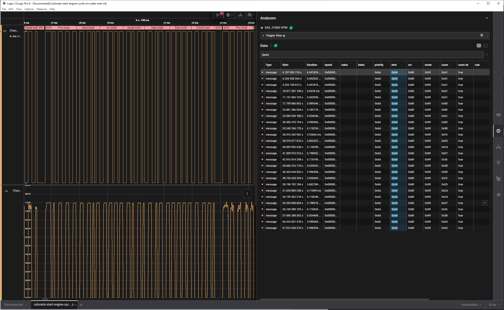

# SAE J1850 VPW Analyzer for Saleae Logic 2



A protocol analyzer plugin for [Saleae Logic 2](https://www.saleae.com/) that
decodes the **SAE J1850 Variable Pulse Width** vehicle bus — the GM Class 2
bus used on OBD-II and module-to-module communication on GM vehicles from the
mid-1990s through the late 2000s. Auto-detects 1× (10.4 kbps) and 4×
(41.6 kbps) modes per frame.

## Features

- Auto-detects 1× and 4× speeds from the SOF pulse width
- User-selectable active polarity (transceiver-output vs raw-bus probing)
- J1850 CRC-8 verification with failed-checksum highlighting
- Header field labeling: priority, destination, source, mode bytes
- FrameV2 records for Logic 2 search and structured export
- Built-in simulation waveform for "Use Simulation Data"
- Cross-compiles to a Windows DLL from Linux/WSL

## Quick start

```sh
# Linux .so
cmake -S . -B build && cmake --build build -j
# → build/Analyzers/libJ1850VpwAnalyzer.so
```

Drop the resulting `.so` (or pre-built `.dll`) into Logic 2's custom analyzers
folder (**Edit → Preferences → Custom Low Level Analyzers**), restart, then
**Analyzers → Add Analyzer → SAE J1850 VPW**. Pick the channel and active
polarity and you're decoding.

If your capture was taken on an analog channel rather than a digital one, in
Logic 2 first apply a digital threshold (channel settings → "Apply Digital
Threshold") around 3–4 V — J1850 idles at 0 V passive and pulses to ~7 V
active.

## Documentation

- [**docs/BUILD.md**](docs/BUILD.md) — Build, install, and test instructions
  for Linux, Windows, and WSL cross-compilation
- [**docs/USAGE.md**](docs/USAGE.md) — Analyzer settings, frame/annotation
  schema, FrameV2 export schema, CSV export
- [**docs/PROTOCOL.md**](docs/PROTOCOL.md) — VPW physical-layer reference:
  bit timing, encoding rules, frame structure, CRC-8

The SDK skeleton follows Saleae's
[SampleAnalyzer](https://github.com/saleae/SampleAnalyzer) template.
